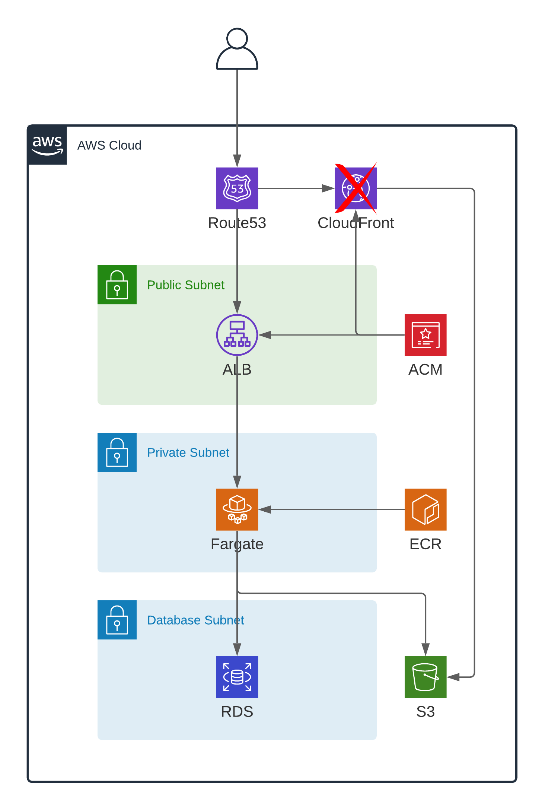

# Stylesage IOTD test

Hi there!
Thank you for letting me participate in the selection process and be able to take this test. Some of the decisions I've made in the code may not be based in a real project and just adjusted them for the test.
Below I will add a section with the changes I would make for a real project.

I was going to use CloudFront to serve statics from S3 bucket but AWS needs to enable it for you, I opened a ticket but I haven't received an answer yet.

Note: I had to change `ALLOWED_HOSTS = []` to `ALLOWED_HOSTS = [‘*’]`.

## Architecture

## Requirements:
- [X] We want to have CI/CD on this service
- [X] We want to provision infrastructure in a repeatable way
- [X] We want to deploy the service in an automated and repeatable way
- [X] We want to have multiple environments (production, pre-production) and enable local development:
    - PRO: https://iotd.cesararroba.com/
    - PRE: https://iotd.pre.cesararroba.com/
    - Local: `docker-compose up -d --build`
- [X] We want to have secure access to RDS and S3

## Answering questions

### How would you provision infrastructure?
I've used Terraform for the IaC. I use it in a different way you will maybe see out there, instead of using `.tfvars` files I use a `workspace.tf` file to storage all the variables.
I've separated the stack in two:
    - Base: contains shared resources for apps stacks 
    - App: contains specific application resources
I'm using terraform `terraform_remote_state` to talk between them. To be able to use this you need to talk between each other using a remote stack which I've stored in S3.

### How would you setup CI / CD?
I've tried using GitHub Actions (please be nice, I'm totally newbie here).
I've written three workflows:
    - pr-terraform.yaml: Makes a plan when you open a PR and have done changes on terraform directory
    - pr-code-test.yaml: Runs application tests using github-actions services to have a useful postgresql and s3
    - deployment.yaml: Runs deployment steps:
        - Builds and pushes docker image to ECR
        - Deploys base terraform stack on PRE environment
        - Deploys app terraform stack on PRE environment
        - Deploys base terraform stack on PRO environment
        - Deploys app terraform stack on PRO environment

For deployment, instead of using AWS user credentials I'm using [GitHub OIDC](https://docs.github.com/es/actions/deployment/security-hardening-your-deployments/configuring-openid-connect-in-amazon-web-services) and a role to assume.
I would need to research more about this as I'm not totally satisfied with it, but I think it's ok for a test.
        
### Is it advisable to use a container technology? Can you elaborate on advantages and disadvantages?
For this application we are using on the test, yes, totally. It doesn't need too much resources to run and is a fast and cheap way to run it.
Advantages:
    - Flexibility: to use on or another code language you only need to choose the correct base image
    - Easy management: they don't usually need much to do to run your application
    - Deployment speed: build it, run it
    - Scalability: much easier to scale when you divide your application in multiple services
    - Security: if you do it right, it's just one piece to be accesed, so it's easier to limit/unlimit it
    - Reliability: having an application divided in different microservices won't make the whole platform fail if one goes down
Disadvantages:
    - Costs: it depends on your architecture but dividing your application in different microservices can give you more costs than a monolithic
    - Data: unless you use external storage, if a container fails or goes down you will loose its data
  
### How do you deploy code the provisioned infrastructure?
Using a docker image tagged with the commit so terraform can change it everytime there is a new release.

### How do you ensure that the service can connect to the database? (connection string, credentials, permissions)
Database uses a security group which allows access only for the container's security group.
For conectivity I'm directly passing to the container the database connection data from the db module outputs.

### How do you ensure that the service can access S3 securely?
Bucket is private by default and I have given only permissions to the container on its IAM role. Also on its policy I'm only allowing SSL requests and I've enabled encryption by default.

### How do you monitor performance and availability?
I would use CloudWatch with container insights enabled for performance and CloudWatch alerts to know if a container goes down or there is any issue. 

### What about scalability?
I would scale this application based on the requests the load balancer is receiving as it probably won't need to use much CPU/Memory to attend requests.
Of course I would take a look at metrics periodically to know if I'm correct or not and change its scalability in consecuence.

### Security considerations
- Minimum permissions for every service
- Security groups only open to needed resources
- Avoid using root on containers
- Backend and database in private subnets

## Changes for a real project
- Improve CI/CD pipeline and workflows
- Think and apply best deployment strategy for the application (Rolling Release, Canary, Blue/Green...)
- Split base terraform stack in a different repository
- In case this kind of deployment is recurrent in the company, build a terraform module
- Control modules versioning from base stack
- Offer templates or modules to the development team to avoid them a big learning curve
- Use CloudFront to serve statics if service is public
- Deploy PostgreSQL with Aurora or Serverless if it fits our needs, if not use MultiAZ deployment on RDS
- Create a backup and recovery plan for database
- Enable container insights on ECS or use an APM for tracing and other metrics tool, eg. OpenTelemetry and Telegraf
- Think which container orchestrator fits better for the company
- Apply scalability on container service, try to use spot
- Service healthcheck should check if it has access to used resources (I know django healthcheck can do this)
- Use KMS to encrypt all sensitive data, even on deployments
- Cloud Governance, limit permissions and close not used regions, everything should be deployed by code and automatically to avoid human errors
